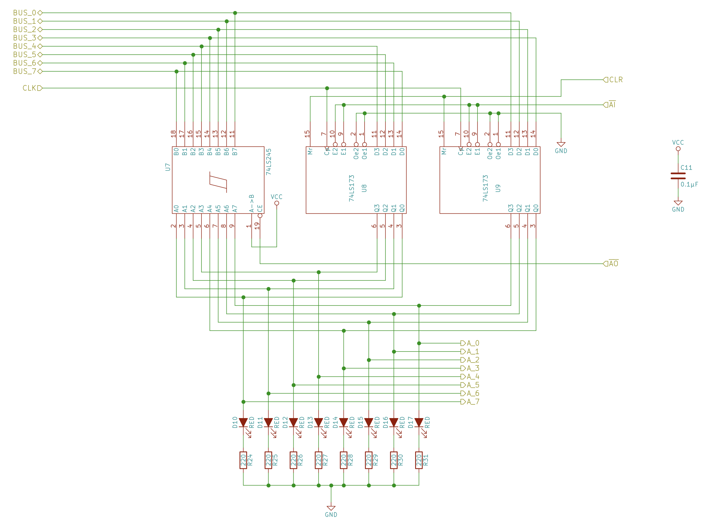
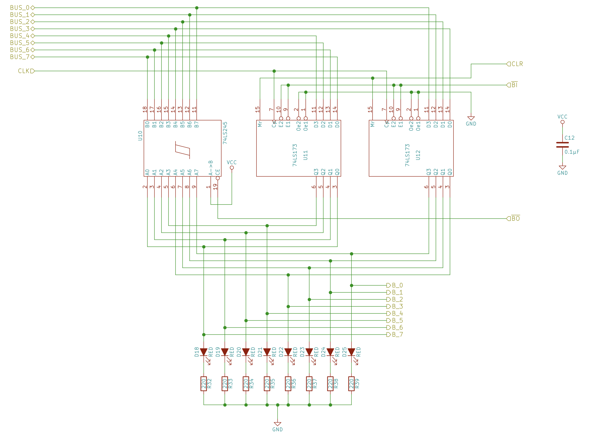

= 8-bit breadboard computer Kit 2: Registers and ALU
Jessie Frazelle <jessie@embedded.ventures>
v1.0, 2021-05-05

You’re going to be building the storage for bits of data for the computer.

Based on videos here: https://eater.net/8bit/registers and https://eater.net/8bit/alu 

== A register

[#img-a-register] 
.Schematic: A register
  

== B Register

[#img-b-register] 
.Schematic: B register
  

== Instruction register

[#img-instruction-register] 
.Schematic: Instruction register
image::ir.png[Schematic for the Instruction Register]  
